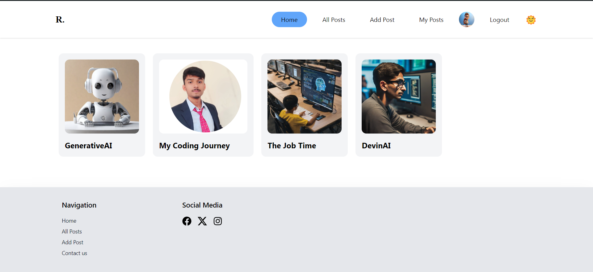
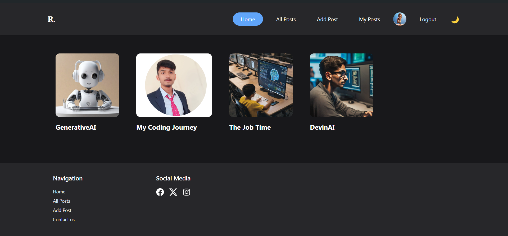

# Blog Application

## Description

This is a simple blog application that allows users to create, read, update and
delete posts. It uses the MVC (Model-View-Controller). To make it more secure I
have used authentication where you first login to use the application. The user
is redirected to a dashboard. Where user can see all the posts and create the
post. It is also fully responsive application. It uses React library and
Tailwind for the frontend and Appwrite for the backend. I have also provided the
Dark mode and Light mode theme.

## Light Mode:



## Dark Mode:



## To clone this project, follow these steps:

### Prerequisites:

- Node.js installed on your machine
- Git installed on your machine

1. Open Terminal or Command Prompt
2. Navigate to the directory where you want to store the cloned project
3. Type and hit Enter

```bash
    git clone https://github.com/johnsoncodehub/blog-application.git
```

4. Wait for the cloning process to complete
5. After the cloning is completed, navigate into the project folder.
6. Now you can see the project files and folders.
7. Use below command to install all dependencies (Make sure you are in the
   project folder)

```bash
    npm install
```

5. Now you have the project on your local system. Go ahead and explore it.

## Project Setup:

- To create the React Project I have used **VITE**

```bash
    npm create vite@latest
```

- Taiwind CSS for styling

```bash
    npm install -D tailwindcss postcss autoprefixer
    npx tailwindcss init -p
```

- Redux toolkit and React-redux

```bash
    npm i @reduxjs/toolkit
    npm install react-redux
```

- React router dom

```bash
    npm install react-router-dom
```

- Appwrite, I am using appwrite as my backend serveice of my blog application

```bash
    npm install appwrite
```

- Tinymce react library for text editor

```bash
    npm install @tinymce/tinymce-react
```

- HTML react-parser for parsing the string from HTML elements

```bash
    npm install html-react-parser
```

- React-hook-form to handle the forms in react

```bash
    npm install react-hook-form
```

## To create the User account and Login and Logout by using appwrite as backend service

```javascript
import { Account, Client, ID } from "appwrite";
//importing my config file for accessing the .env file data
import config from "../config/config";

export class AuthService {
  client = new Client();
  account;

  constructor() {
    this.client
      .setEndpoint(config.appwriteUrl)
      .setProject(config.appwriteProjectId);
    this.account = new Account(this.client);
  }

  async createAccount({ email, password, name }) {
    try {
      const userAccount = await this.account.create(
        ID.unique(),
        email,
        password,
        name
      );
      if (userAccount) {
        // calling another method
        this.login({ email, password });
      } else {
        return userAccount;
      }
    } catch (error) {
      throw error;
    }
  }

  async login({ email, password }) {
    try {
      return await this.account.createEmailSession(email, password);
    } catch (error) {
      throw error;
    }
  }

  async getCurrentUser() {
    try {
      return await this.account.get();
    } catch (error) {
      throw error;
    }
    return null;
  }

  async logout() {
    try {
      return await this.account.deleteSessions();
    } catch (error) {
      throw error;
    }
  }
}

const authService = new AuthService();

export default authService;
```

## To CREATE,UPDATE and DELETE post you can use the following code:

```javascript
import { Client, Databases, Storage, ID, Query } from "appwrite";
import config from "../config/config";

export class Service {
  client = new Client();
  databases;
  bucket;

  constructor() {
    this.client
      .setEndpoint(config.appwriteUrl) //Use or own API keys
      .setProject(config.appwriteProjectId); // User or own ProjectId
    this.databases = new Databases(this.client);
    this.bucket = new Storage(this.client);
  }

  async createPost({ title, content, slug, featuredImage, status, userId }) {
    try {
      return await this.databases.createDocument(
        config.appwriteDatabaseId,
        config.appwriteCollectionId,
        slug,
        {
          title,
          content,
          slug,
          featuredImage,
          status,
          userId,
        }
      );
    } catch (error) {
      throw error;
    }
  }

  async updatePost(slug, { title, content, featuredImage, status }) {
    try {
      return await this.databases.updateDocument(
        config.appwriteDatabaseId,
        config.appwriteCollectionId,
        slug,
        {
          title,
          content,
          featuredImage,
          status,
        }
      );
    } catch (error) {
      console.log(error);
    }
  }

  async deletePost(slug) {
    try {
      await this.databases.deleteDocument(
        config.appwriteDatabaseId,
        config.appwriteCollectionId,
        slug
      );
      return true;
    } catch (error) {
      console.log(error);
      return false;
    }
  }

  async getPost(slug) {
    try {
      return await this.databases.getDocument(
        config.appwriteDatabaseId,
        config.appwriteCollectionId,
        slug
      );
    } catch (error) {
      console.log(error);
      return false;
    }
  }

  async getPosts(queries = [Query.equal("status", "active")]) {
    try {
      return await this.databases.listDocuments(
        config.appwriteDatabaseId,
        config.appwriteCollectionId,
        queries
      );
    } catch (error) {
      console.log(error);
      return false;
    }
  }

  async getCurrentUserPosts(userId) {
    try {
      const queries = [
        Query.equal("status", "active"),
        Query.equal("userId", userId),
      ];
      return await this.databases.listDocuments(
        config.appwriteDatabaseId,
        config.appwriteCollectionId,
        queries
      );
    } catch (error) {
      console.log(error);
      return false;
    }
  }

  // file upload service

  async uploadFile(file) {
    try {
      return await this.bucket.createFile(
        config.appwriteBucketId,
        ID.unique(),
        file
      );
    } catch (error) {
      console.log(error);
    }
  }

  async deleteFile(fileId) {
    try {
      await this.bucket.deleteFile(fileId);
      return true;
    } catch (error) {
      console.log(error);
      return false;
    }
  }

  getFilePreview(fileId) {
    return this.bucket.getFilePreview(config.appwriteBucketId, fileId);
  }
}

const service = new Service();
export default service;
```

### Redux Store:

```javascript
import { configureStore } from "@reduxjs/toolkit";
import authSlice from "./authSlice";
import postSlice from "./postSlice";

const store = configureStore({
  reducer: { auth: authSlice, post: postSlice },
});

export default store;
```

### Redux Store for authentication:

```javascript
import { createSlice } from "@reduxjs/toolkit";

const initialState = {
  status: false,
  userData: null,
};

const authSlice = createSlice({
  name: "auth",
  initialState,
  reducers: {
    login: (state, action) => {
      state.status = true;
      state.userData = action.payload;
    },
    logout: (state) => {
      state.status = false;
      state.userData = null;
    },
  },
});

export const { login, logout } = authSlice.actions;
export default authSlice.reducer;
```

### Redux store for posts:

```javascript
import { createSlice } from "@reduxjs/toolkit";

const postSlice = createSlice({
  name: "post",
  initialState: {
    posts: [],
    userPosts: [],
    loading: true,
  },
  reducers: {
    setPostInStore: (state, action) => {
      state.posts = action.payload;
      state.loading = false;
    },
    setUserPosts: (state, action) => {
      state.userPosts = action.payload;
      state.loading = false;
    },
  },
});
export const { setPostInStore, setUserPosts } = postSlice.actions;

export default postSlice.reducer;
```

## Thank You!!
